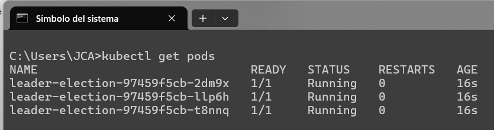
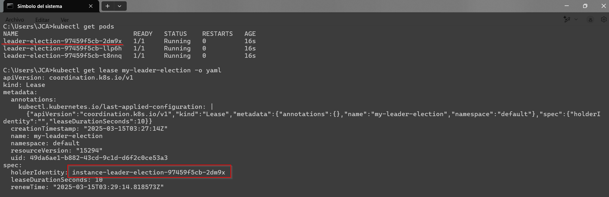
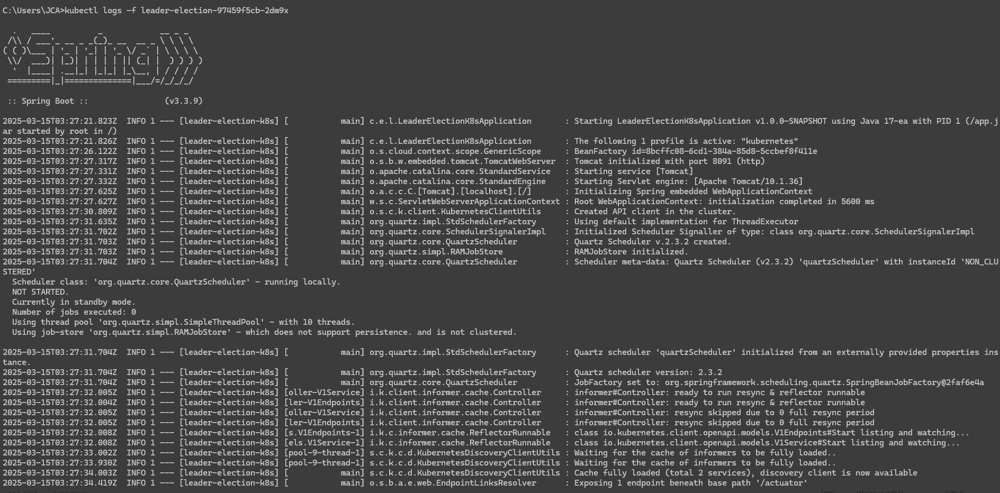
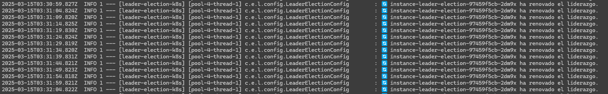

[](https://adoptium.net/es/temurin/releases/?os=windows&arch=any&package=jdk&version=17)

[](https://mvnrepository.com/artifact/org.springframework.boot/spring-boot-starter-data-jpa/3.2.5)
[](https://mvnrepository.com/artifact/org.springframework.boot/spring-boot-starter-web/3.2.5)
[](https://mvnrepository.com/artifact/org.projectlombok/lombok/1.18.32)


# Leader Election k8s y Lease API (v1.0.0)

Elección de líder en los pods con kubernetes.

## Requisitos previos

* Tener instalado Java con la versión 17, para que pueda funcionar la librería.
* Tener instalado Docker Desktop.
* Tener instalado Git en su máquina.
* Tener instalado Maven en su máquina 3.8+.
* Tener instalado un IDE de su preferencia.

## Instalación

1. Clonar el repositorio en su máquina local.
2. Abrir el proyecto con su IDE preferido, en mi cado con IntelliJ IDEA.
3. Instalar las dependencias necesarias para el proyecto con el siguiente comando.
    ```
    mvn clean install
    ```
    * Se puede ejecutar desde el IDE o en un terminal de comandos, dentro de la raíz del proyecto.
4. Instalar minikube en su maquina para poder realizar el despliegue de los pods.
    ```
    choco install minikube
    ```
    * Luego de instalar minikube, se debe iniciar el servicio con el siguiente comando.
    ```
    minikube start --driver=docker
    ```
    * Este comando iniciará el servicio de minikube con el driver de docker, para que pueda funcionar correctamente.
    * No olvidar que se debe tener instalado Docker Desktop en su máquina e iniciado.
5. Luego hay que crear la imagen de Docker para poder desplegar los pods.
    ```
    docker build -t leader-election-k8s:1.0.0-SNAPSHOT .
    ```
    * Este comando creará la imagen de Docker con el nombre **leader-election-k8s** y la versión **1.0.0-SNAPSHOT**.
    * Se puede cambiar el nombre y la versión de la imagen, según sea necesario, pero habría que realizar más configuraciones.
6. Luego abrir un comando Bash de Git para ejecutar el siguiente comando:
    ```
    minikube image load leader-election-k8s:1.0.0-SNAPSHOT
    ```
    * Este comando cargará la imagen de Docker en el servicio de minikube.
7. Luego de cargar la imagen, se debe aplicar el archivo de configuración de Kubernetes.
    ```
    kubectl apply -f devops/deploy/rbac.yaml
    ```
    * Este comando aplicará el archivo de configuración de Kubernetes, para que se puedan desplegar los pods.
8. Luego ejecutar el deploy de los servicios.
    ```
    kubectl apply -f devops/deploy/deployment.yaml
    ```
    * Este comando aplicará el archivo de configuración de Kubernetes, para que se puedan desplegar los servicios.
9. Luego de aplicar el archivo de configuración y deploy, se debe verificar que los pods estén corriendo correctamente.
    ```
    kubectl get pods
    ```
    * Este comando mostrará los pods que están corriendo en el servicio de minikube.
   
10. Luego para verificar que haya un pod lider, se debe ejecutar el siguiente comando.
    ```
    kubectl get lease my-leader-election -o yaml
    ```
    * Este comando mostrará el pod líder en el servicio de minikube (my-leader-election), en el campo **holderIdentity**.
    
## Comandos útiles

* Para eliminar el deployment de pods y los servicios, se debe ejecutar el siguiente comando.
    ```
    kubectl delete -f devops/deploy/deployment.yaml
    ```
* Para eliminar el archivo de configuración de Kubernetes, se debe ejecutar el siguiente comando.
    ```
    kubectl delete -f devops/deploy/rbac.yaml
    ```
* Eliminar una imagen de Docker, se debe ejecutar el siguiente comando.
    ```
    docker rmi leader-election-k8s:1.0.0-SNAPSHOT
    ```
* Eliminar la imagen de Docker de minikube, se debe ejecutar el siguiente comando.
    ```
    minikube image rm leader-election-k8s:1.0.0-SNAPSHOT
    ```
* Listar las imagenes de Docker en minikube, se debe ejecutar el siguiente comando.
    ```
    minikube image ls
    ```
* Eliminar un pod de minikube, se debe ejecutar el siguiente comando.
    ```
    kubectl delete pod <nombre_pod>
    ```
   * Donde **nombre_pod** es el nombre del pod que se desea eliminar.
* Reiniciar los pods con deployments, se debe ejecutar el siguiente comando.
    ```
    kubectl rollout restart deployment <nombre_deployment>
    ```
   * Donde **nombre_deployment** es el nombre del deployment que se desea reiniciar para este proyecto es: **leader-election**.
* Revisar los log en los pods, se debe ejecutar el siguiente comando.
    ```
    kubectl logs -f <nombre_pod>
    ```
   * Donde **nombre_pod** es el nombre del pod que se desea revisar los logs, **-f**, hace que se revise el log online.
   
   
* Comando para crear un pod dentro de minikube y poder ejecutar un curl.
    ```
    kubectl run curl-pod --image=curlimages/curl -i --tty --rm -- /bin/sh
    ```
   * Este comando creará un pod y se podrá ejecutar un **curl** dentro del pod.

## Uso

Elección de líder de pods, esta es solo una primera versión para el objetivo que fue desarrollado.

## Contribuir

Por el momento no hay contribuciones.
